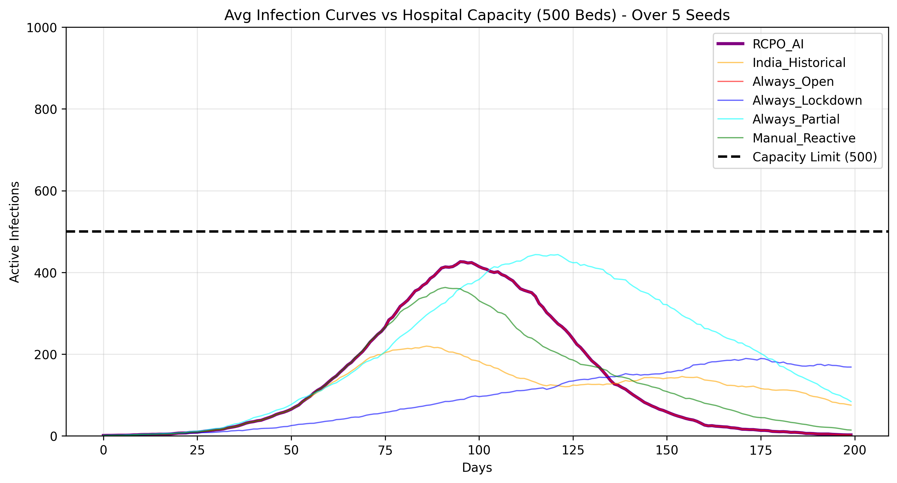
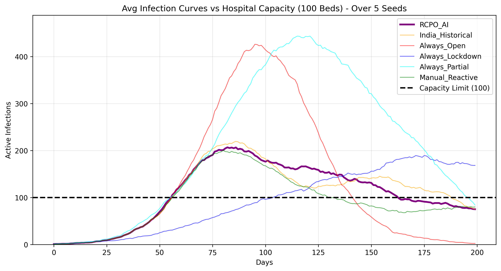
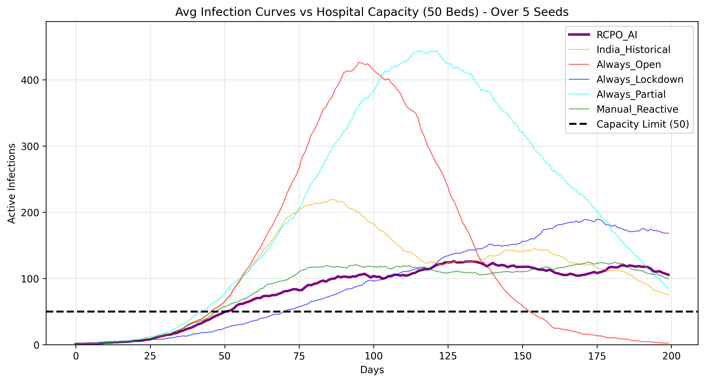
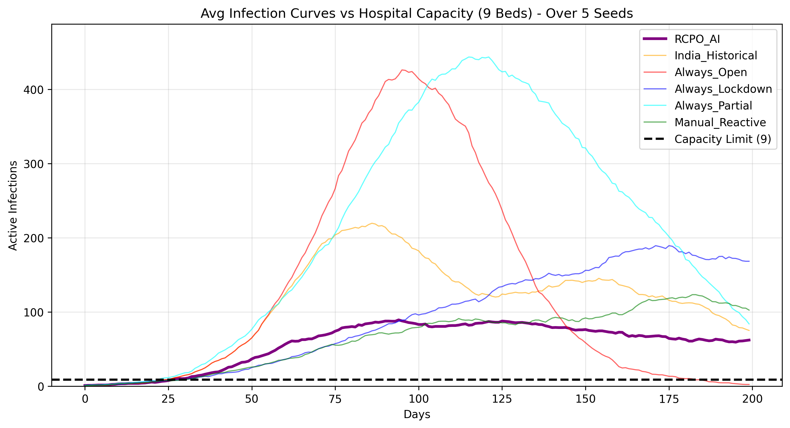

# Optimizing the Unthinkable: A Constrained RL Approach to Pandemic Mitigation

[](https://www.python.org/)
[](https://pytorch.org/)
[](https://opensource.org/licenses/MIT)

##  Overview & Problem Statement
When a severe viral outbreak occurs, policymakers face a strict **Constrained Optimization Problem**: maximize economic output (which requires human mobility) subject to the strict physical constraint of available hospital beds (to minimize fatalities). 

Historically, human heuristics fall into extremes: "Always Open" (causing healthcare collapse) or "Always Lockdown" (causing economic devastation and artificially prolonging the crisis). Furthermore, standard Reinforcement Learning (RL) approaches often rely on subjective "Reward Shaping" (forcing a human to arbitrarily define the mathematical value of a life vs. GDP) or assume homogeneous mixing via ODEs (ignoring spatial neighborhood clusters).

This project solves these gaps by deploying a **Continuous Spatial Multi-Agent Environment** governed by a **Reward Constrained Policy Optimization (RCPO)** agent. By decoupling the economy (Reward) from healthcare capacity (Constraint via a Lagrangian multiplier), the AI dynamically discovers Pareto-optimal, spatially-aware pulsing strategies that beat static human heuristics.

---

##  The Environment: Spatial SIRD Physics Engine
A custom 2D Monte Carlo physics simulation was built to realistically model viral spread:
* **Agents & Space:** 2,500 agents maneuver in a continuous 1.0 x 1.0 bounded 2D grid.
* **Mobility:** Every day, agents take a random step of size `L`. This `L` is the "Economy."
* **Transmission:** Euclidean distance checks determine transmission if a susceptible agent enters the infection radius of an infected agent.
* **Dynamic Mortality (The Constraint):** The virus has a strict 21-day cycle. On day 21, the agent faces a mortality roll. If the hospital system is currently *safe*, the Base Case Fatality Rate is 1.5%. If the system is *breached* (active infections > capacity), healthcare collapses, and the fatality rate spikes 3x to 4.5%.

---

##  The Agent: Continuous RCPO
The policymaker is an **Advantage Actor-Critic (A2C)** network utilizing an extended version of RCPO.

* **State Space (Continuous 4D Tensor):** 
  1. Current Infection Count (Burden)
  2. Previous Infection Count (Momentum/Derivative)
  3. Hospital Capacity Limit (The Ceiling)
  4. Spatial Spread (Standard deviation of infected coordinates to detect localized clusters vs. city-wide spread).
* **Action Space (Continuous 1D Tensor):** A Sigmoid output linearly scaled to a mechanical step size between `L_min = 0.016` (Strict Lockdown) and `L_max = 0.040` (Fully Open). Acts as a fluid "dimmer switch" on the economy.
* **Reward:** Daily economic points based on how close `L` is to `L_max`.
* **Constraint Penalty:** A dynamic Lagrangian multiplier (`lambda`).

### Algorithmic Innovations
Training a CMDP agent in an environment with a 21-day temporal lag causes severe gradient instability (e.g., Reward Hacking and Mode Collapse). We engineered two specific solutions:
1. **Action-Scaled Penalties:** Because a breach lasts for weeks, an AI will often realize it is "doomed anyway" and stay 100% open during a crisis. We scaled the breach penalty to the step size. Moving *fast* during a breach exponentially multiplies the penalty, forcing the AI to dynamically hit the brakes.
2. **Target-Based Asymmetric Gradients:** Early exploration penalties often caused the `lambda` gradient to skyrocket to infinity, causing permanent lockdowns. We implemented a 10% "grace margin" (tolerating small errors) with asymmetric learning rates, allowing `lambda` to find a stable equilibrium.

---

##  Results & Visualizations
To ensure statistical significance and avoid "spatial flukes" (e.g., Patient Zero walking into an empty corner), all policies were rigorously evaluated across **5 distinct random environment seeds**. 

### Master Evaluation Data
The AI scales its behavior perfectly based on healthcare capacity. For tight capacities (9-100 beds), it actively balances the curve. For massive capacities (500 beds), it learns the mathematical concept of "Acceptable Losses," behaving like an open economy because the healthcare system can absorb the spike.

| Capacity | Policy | Avg Mobility (Economy) | Days Breached | Avg Deaths |
| :--- | :--- | :---: | :---: | :---: |
| **500 Beds** | **RCPO AI** | **8.00** | **24** | **42** |
| | India Historical | 5.43 | 0 | 18 |
| | Always Open | 8.00 | 24 | 42 |
| | Always Lockdown | 3.20 | 0 | 11 |
| | Always Partial | 5.60 | 18 | 42 |
| | Manual Reactive | 7.39 | 16 | 32 |
| **100 Beds** | **RCPO AI** | **5.97** | **86** | **42** |
| | India Historical | 5.43 | 85 | 48 |
| | Always Open | 8.00 | 59 | 54 |
| | Always Lockdown | 3.20 | 87 | 29 |
| | Always Partial | 5.60 | 117 | 79 |
| | Manual Reactive | 5.82 | 84 | 35 |
| **50 Beds** | **RCPO AI** | **5.49** | **95** | **32** |
| | India Historical | 5.43 | 96 | 49 |
| | Always Open | 8.00 | 72 | 55 |
| | Always Lockdown | 3.20 | 106 | 31 |
| | Always Partial | 5.60 | 133 | 81 |
| | Manual Reactive | 5.65 | 96 | 33 |
| **9 Beds** | **RCPO AI** | **5.38** | **107** | **21** |
| *(Extreme)* | India Historical | 5.43 | 107 | 49 |
| | Always Open | 8.00 | 97 | 56 |
| | Always Lockdown | 3.20 | 136 | 31 |
| | Always Partial | 5.60 | 164 | 81 |
| | Manual Reactive | 5.39 | 107 | 25 |

### Key Inferences
*   **Adaptive Intelligence:** The RCPO AI dynamically adjusts its stringency based on capacity. At 500 beds, it perfectly mimics the "Always Open" policy, recognizing the healthcare system is large enough to absorb the infections without penalty. As capacity tightens (100 down to 9), it actively throttles mobility to protect the healthcare constraint.
*   **Beating Static Baselines:** At extreme constraints (9 beds), the AI vastly outperforms a permanent "Always Lockdown" strategy. It sustains a significantly higher economic mobility (5.38 vs 3.20) while reducing the death toll (21 vs 31) by discovering a highly efficient "pulsing" rhythm that burns through the virus without overwhelming the limited beds for extended periods.
*   **Outperforming Human Heuristics:** Across all critical capacities (100, 50, 9), the AI consistently achieves a better Pareto-optimal balance than the "India Historical" and "Manual Reactive" baselines, demonstrating the power of continuous Lagrangian constraint optimization over rigid human-designed rules.

### The "Pareto Optimal" Policy (Capacity 9 Beds)
At a highly restrictive capacity of 9 beds, a static "Always Lockdown" artificially freezes the virus, keeping the hospital collapsed for 136 days and causing 31 deaths. Our AI discovered a brilliant "pulsing" strategy: staying slightly more open, burning through the virus faster, dropping the collapse duration to 107 days, and saving 10 more lives while improving the economy.


### Multi-Seed Infection Curves
*The thick purple line represents the RCPO Agent's intelligent curve flattening.*

**Capacity: 500 Beds**  


**Capacity: 100 Beds**  


**Capacity: 50 Beds**  


**Capacity: 9 Beds**  


---

##  How to Run the Code

The repository includes a fully automated pipeline script that handles OS dependencies, virtual environments, execution, training, and media generation.

### Option 1: Standard Linux / WSL Execution
1. Clone the repository:
   ```bash
   git clone https://github.com/saumya-a-chauhan/Covid-Lockdown-Optimization_Using_Reinforcement_Learning.git 
   cd Covid-Lockdown-Optimization_Using_Reinforcement_Learning
   ```
2. Run the automated bash script:
   ```bash
   bash run.sh
   ```

### Option 2: Docker (Isolated Environment)
If you wish to run the code in a completely sterile container without affecting your host machine:
```bash
# 1. Start an interactive Ubuntu container
docker run -it ubuntu:22.04 /bin/bash

# 2. Inside the container, install git and clone
apt-get update -y && apt-get install git -y
git clone https://github.com/saumya-a-chauhan/Covid-Lockdown-Optimization_Using_Reinforcement_Learning.git 
cd Covid-Lockdown-Optimization_Using_Reinforcement_Learning

# 3. Execute the pipeline
bash run.sh
```

##  Repository Structure
* `assets/` - Contains media assets, GIFs, and PNG graphs for the README.
* `train_continuous_sird.py` - The main RCPO algorithm, A2C network definitions, and 5000-episode training loop.
* `sir_env.py` - The 2D spatial Monte Carlo physics engine.
* `evaluate_baselines.py` - Multi-seed evaluation script comparing the AI against human heuristics.
* `run.sh` - The master execution pipeline.
